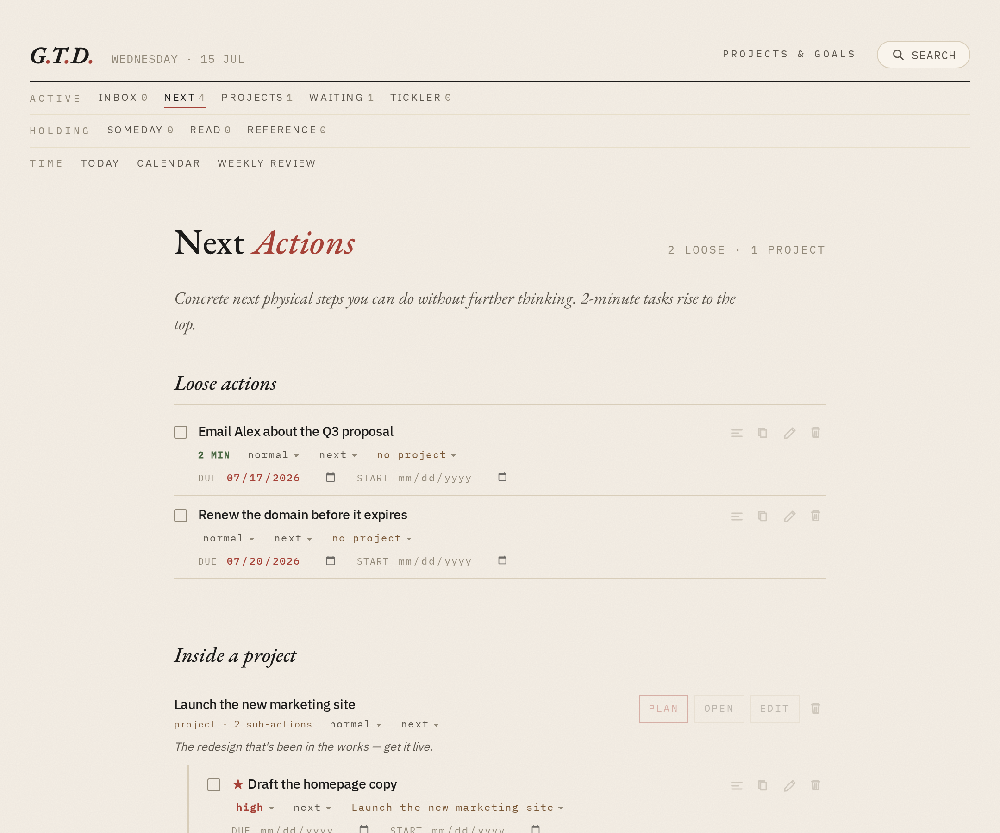
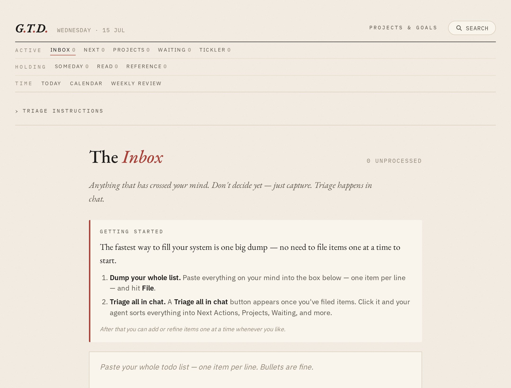
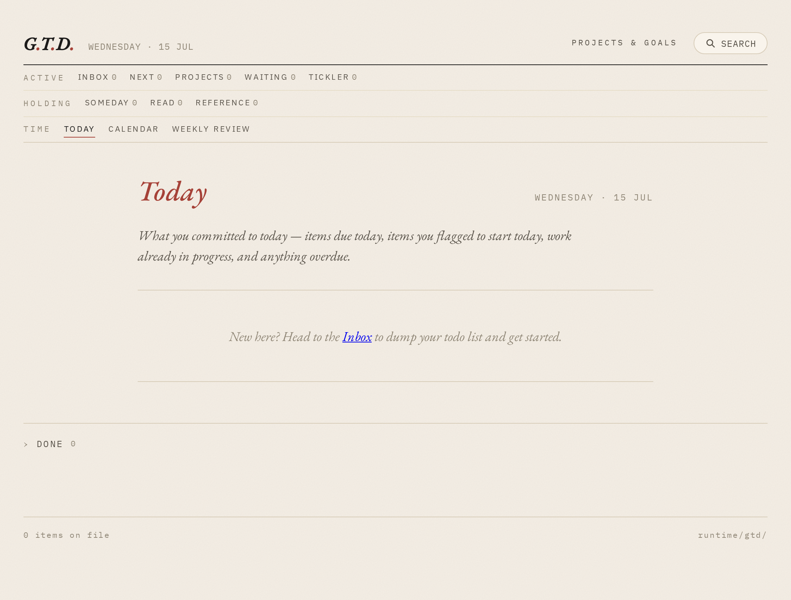

# Plain-Text GTD

A calm, plain-text [GTD](https://gettingthingsdone.com/) (Getting Things Done)
task manager — inbox, next actions, projects, calendar, and weekly review —
backed by markdown files and served as a ruled-paper web app.

There's no database and no cloud service: every task is an ordinary markdown
file with a little YAML header, and the whole thing renders as a warm,
ruled-paper "commonplace book" you open in your browser. It's built to be
edited from either side — by you in the UI or on disk, and by an AI agent in
chat — without surprises.

  

Didn't work? Create a Minds workspace and paste this to your agent:
`/use-inspiration https://github.com/pseay-imbue/plain-text-gtd`

## What it is

You capture by pasting a block of lines into the Inbox (one task per line), and
you process by moving items into buckets, setting due/start dates, grouping
actions under projects, and running a weekly review. The nav clusters by mental
mode:

- **Active** — Inbox, Next Actions, Projects, Waiting, Tickler
- **Holding** — Someday/Maybe, Read & Review, Reference
- **Time** — Today, Calendar, Weekly Review

The distinctive move is that the actual *thinking* — deciding what a vague item
really means, what the next physical action is, what a project needs — happens
in **chat with an agent** rather than by clicking. Each row has "Triage in
chat", "Plan", and "Handoff" buttons that copy a ready-made prompt you paste
into your agent.

## Getting started

A brand-new install greets you with a Getting Started panel: dump your whole
list into the Inbox, then hit **Triage all in chat** and your agent sorts it
into Next Actions, Projects, Waiting, and more. You refine one item at a time
whenever you like.

The Today view is your daily home — what's due, what you flagged to start, work
already in progress, and anything overdue:

## How it works

`system/apps/gtd` is the whole application: a small FastAPI + Jinja2 web service with
no database.

- `src/gtd/data_types.py` — the frozen `Item` model (status, priority, dates,
  project links, tags/contexts).
- `src/gtd/storage.py` — reads/writes each item as a markdown file with YAML
  frontmatter under `data/.apps/gtd/items/<id>.md`, plus the sidecar
  `instructions.md` (editable triage rules) and `weekly_review_prompt.md`.
- `src/gtd/runner.py` — the FastAPI app: every view, the inline edit endpoints,
  the project cascade logic, and `main()`.
- `src/gtd/assets/` — the templates, CSS, and JS that give it the ruled-paper
  look; `assets/defaults/` holds the starter files seeded on first boot.

It runs as a workspace service (see the `[program:gtd]` block in
`supervisord.conf`), binding Uvicorn to `localhost:8082` and serving at
`/service/gtd/`. It reads two environment variables: `ROOT_PATH` (URL prefix;
empty when run standalone via `uv run gtd`) and `GTD_ROOT` (storage directory,
defaulting to `data/.apps/gtd`). Nothing else connects to it — it's entirely
self-contained and filesystem-backed, with **no accounts, API keys, or
credentials**.

## Adapting this

This repository is a [Minds](https://imbue.com) **inspiration** — a bootable
snapshot you can create a new mind from, not just read. Once adopted, an agent
follows [`inspiration-plain-text-gtd.md`](inspiration-plain-text-gtd.md) to
present and adapt it. The short version of what to make your own:

- **Rewrite the starter triage rules and weekly-review prompt** to fit your own
  contexts, priorities, and buckets (editable at `/instructions` and
  `/weekly-review`).
- **Wire the in-chat buttons to your agent** — the Triage/Plan/Handoff prompts
  are meant to be pasted into your chat agent, which writes the results back to
  the item files. Without an agent it's still a fully functional *manual* GTD
  tool.
- **Optional context** starts empty: Projects & Goals
  (`projects_and_goals.md`, read during triage) and Daily Intentions
  (`intentions.md`, pinned to Today).
- **Single-user, no auth**, and the port (`8082`) is hardcoded — add
  authentication and change the port if you expose it beyond a private
  workspace.
